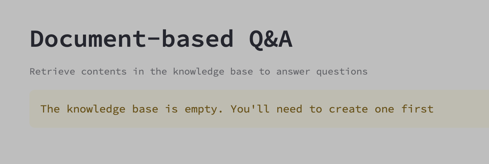
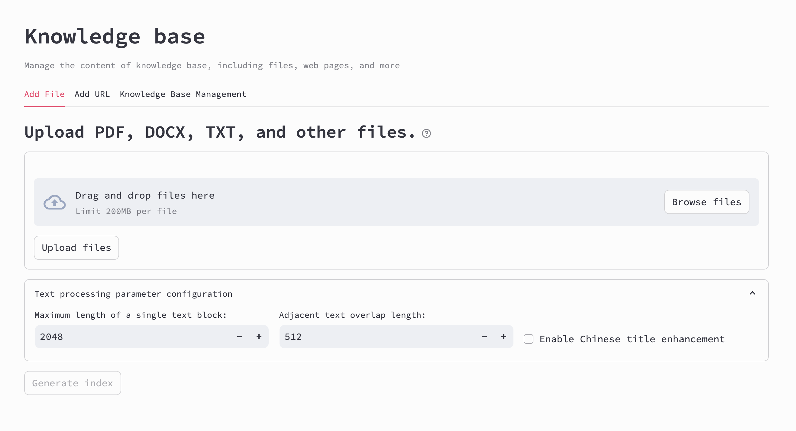
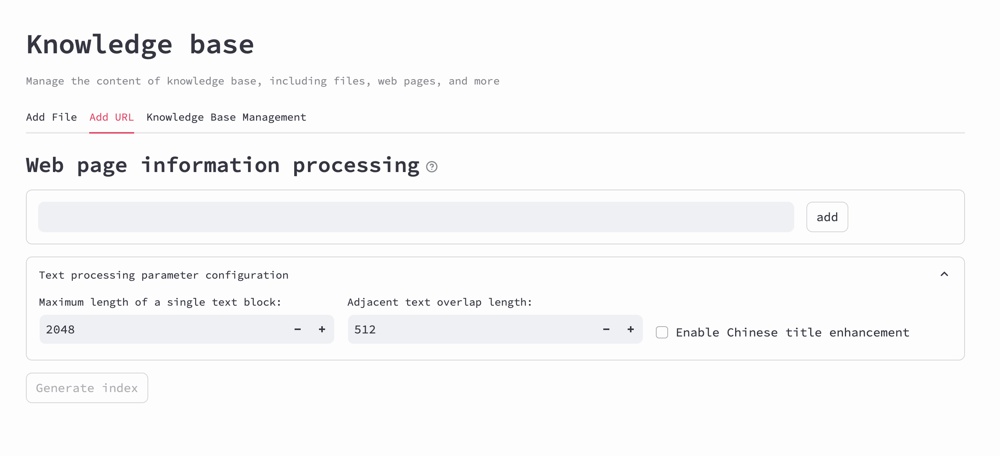
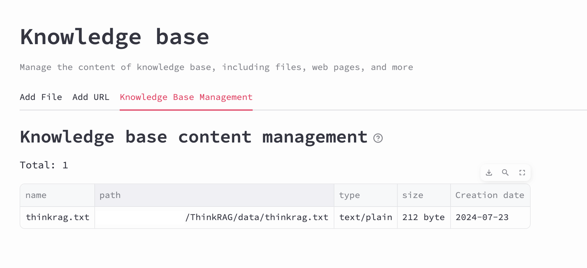
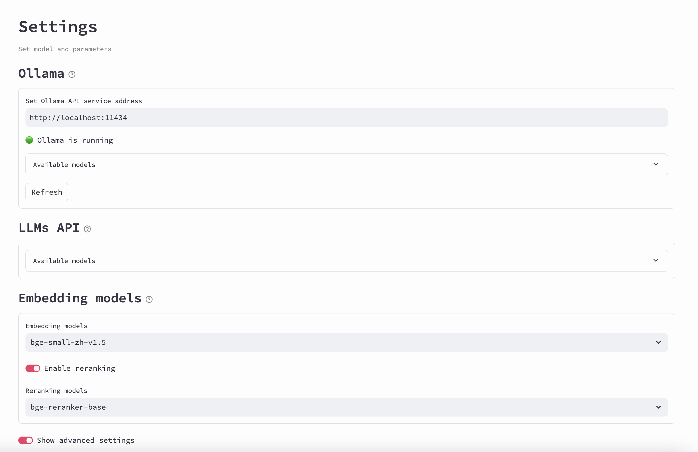
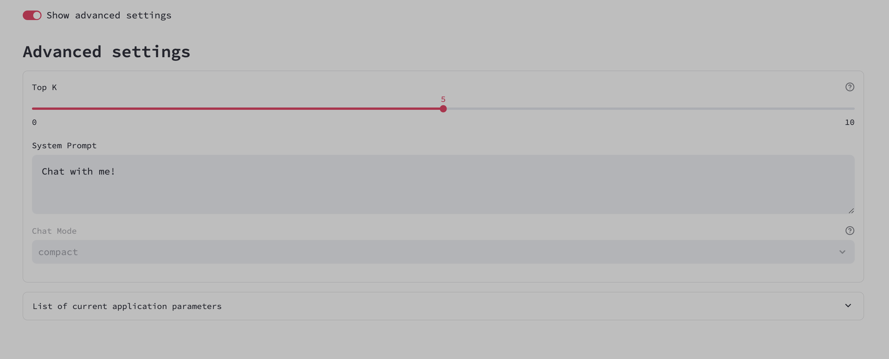
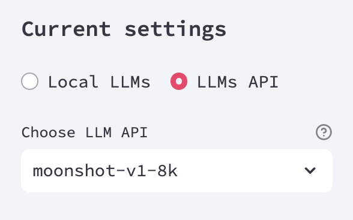

    

        创建你的个人知识库 👤
    

Think 作为本地大语言模型知识库问答系统，首选需要保证具备知识库来运作。

</a>

 
对于第一次使用ThinkRAG的用户，首先要创建自己的知识库。

### ThinkRAG 目前支持文件上传和URL上传:

#### 文件上传 ⏫

</a>

 

这部分界面设计用于在知识库中上传和管理文件（包括所有常用文件类型）。它的特点包括：

 

- 拖放区和用于添加文件的上传按键，每个文件的大小限制为200MB。

- 用于配置文本处理参数的设置，例如文本块的长度和它们之间的重叠，以及增强中文标题处理的选项。

- 一个生成索引的按键，用于上传的文件，便于在知识库中更容易地搜索和检索。

 

#### URL上传 ⏫

</a>

 

此界面专注于在知识库中添加和处理网页URL。它包括：

 

- 用于添加待处理网页URL的区块和按键。

- 与文件上传部分相似的文本处理设置，确保无论内容来源如何，处理方式的一致性。

- 生成索引的按键，处理URL以使网页内容在知识库中可搜索。

 

</a>

 
上传成功后，您可以在知识库管理界面中查看知识库的内容。

#### 注意⚠️
__*在自定义您喜欢的文本处理参数（或保持默认设置）之后，请务必生成索引，否则将影响检索功能的正常工作。*__

  

    

        设置 ⚙️
    

 

</a>

</a>

 

作为管理API服务和高级配置相关设置的界面，允许用户管理和配置各类API服务的设置：

 

- **Ollama API**：用户可以设置和查看Ollama API服务的地址，检查其状态，刷新并选择可用模型。

- **LLMs API**：该部分允许用户查看和管理各种大型语言模型API的设置。

- **嵌入模型**：用户可以选择和配置嵌入模型，启用重排功能并选择特定的重排模型。

- **高级设置开关**：允许用户查看或隐藏高级配置选项。

- **Top-K**：调整在过程中考虑的顶部结果的数量的参数（范围从0到10）。

- **系统提示**：用户可以自定义系统的默认提示。

- **对话模式**：提供对话互动显示方式的选项（例如compact或full，默认为compact）。

这些界面提供了对ThinkRAG全方面功能的控制，使用户能够根据其特定的需求或偏好调整API和其他系统组件的表现。

  

    

        选择LLM 👀
    

 

</a>

 
最后一步！选择你喜欢的大语言模型，开始体验ThinkRAG！

