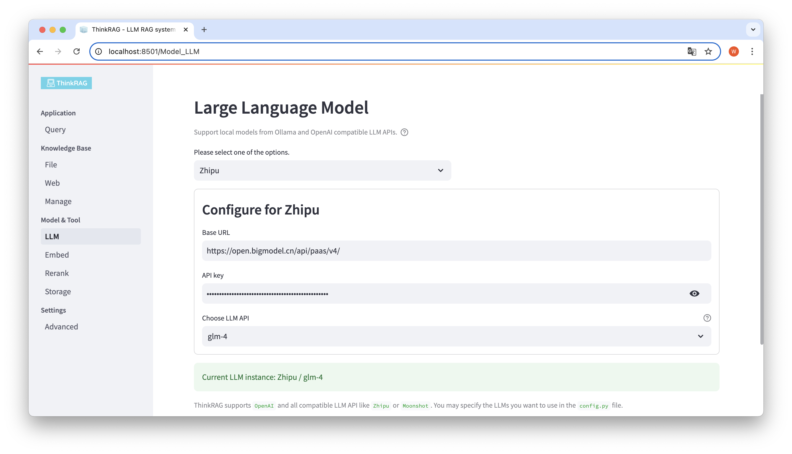
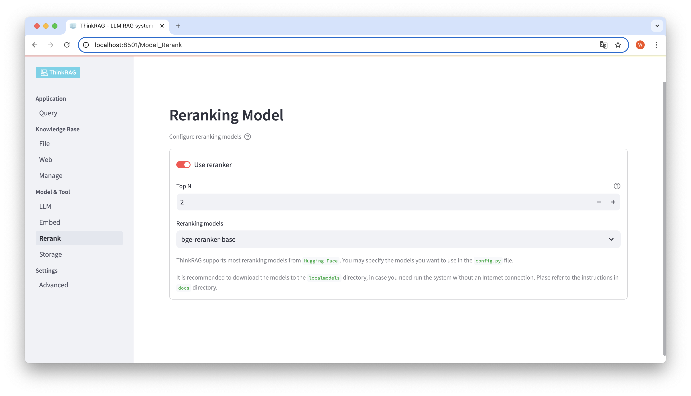
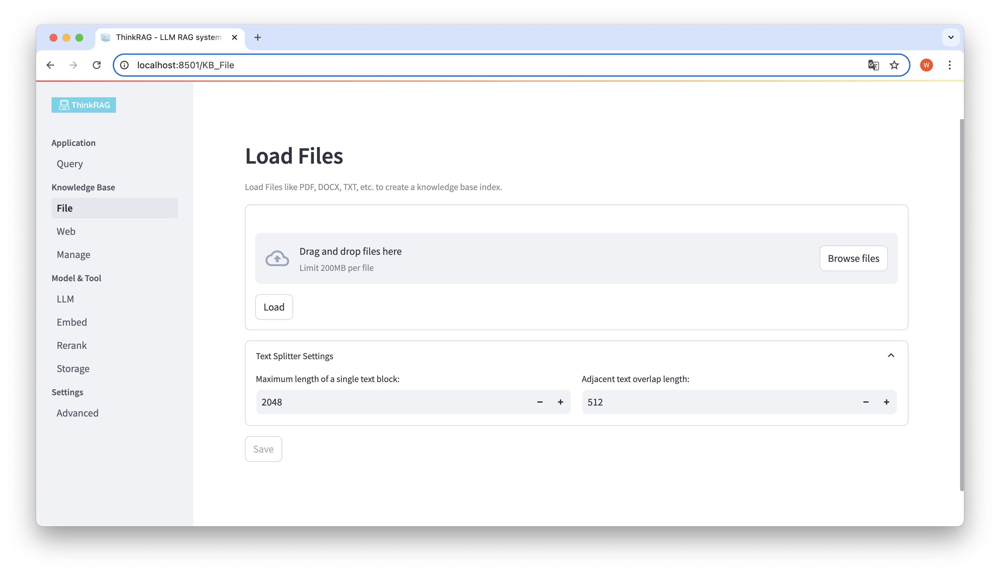
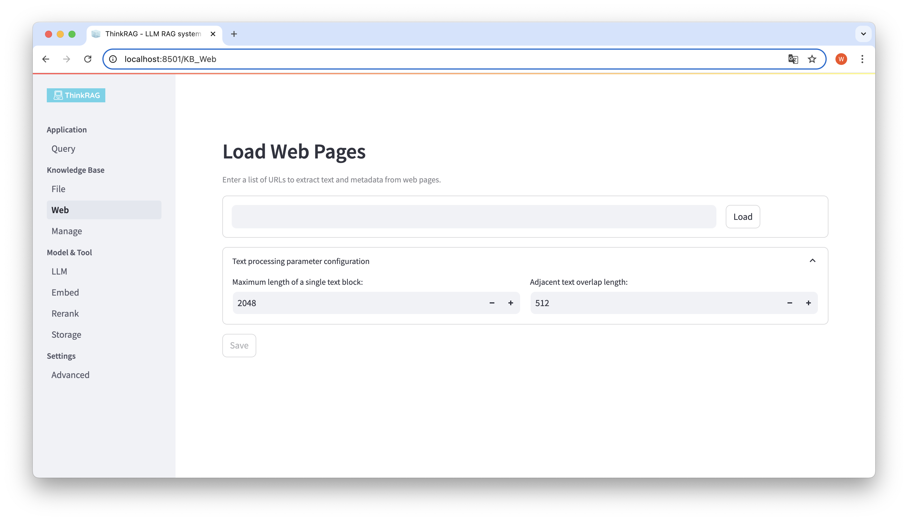
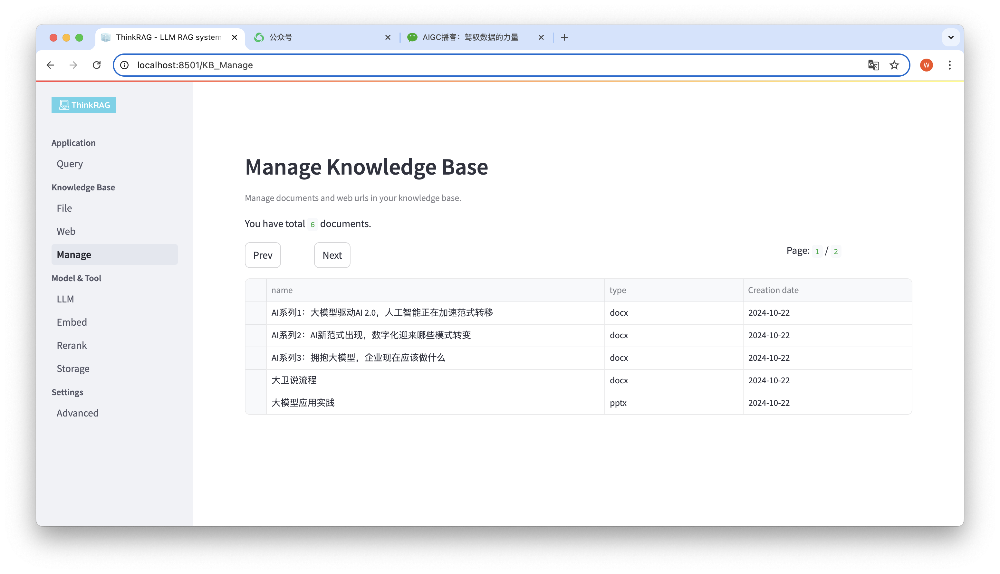
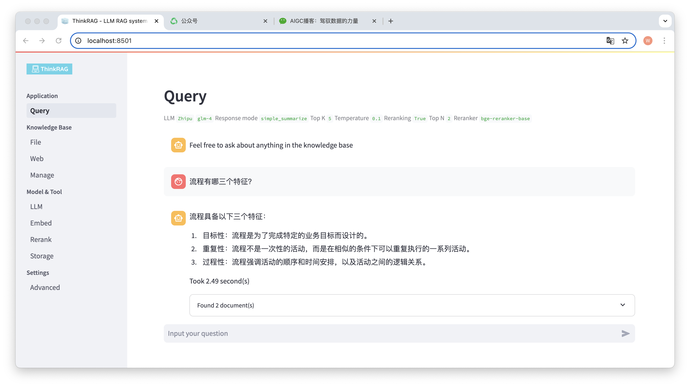
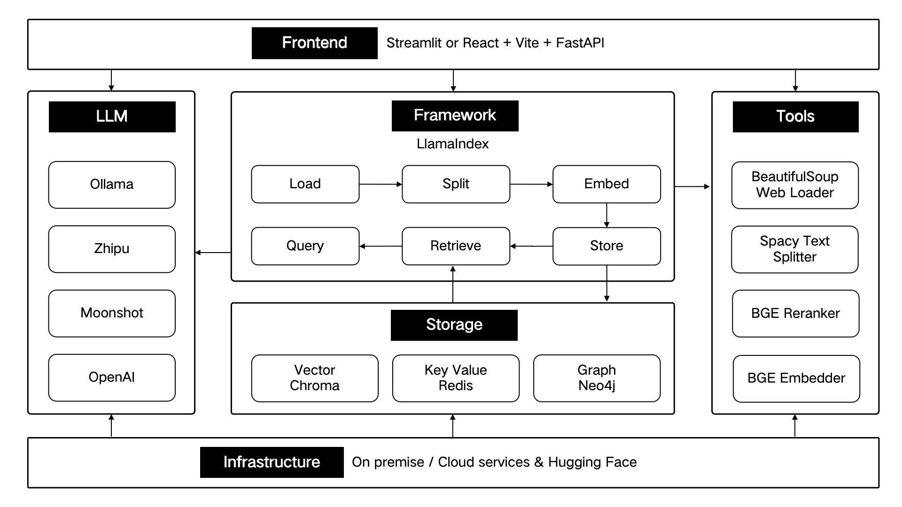

<p align="center">
  <a href="./README_en.md">English</a> |
  <a href="./README.md">简体中文</a>
</p>

<div align="center">

[](./LICENSE) [](https://ollama.com/) [](https://www.llamaindex.ai/)

</div>

### 目录

- 🤔 [项目简介](#What-is-ThinkRAG)
- ✨ [主要特性](#Key-Features)
- 🧸 [模型支持](#Support-Models)
- 🛫 [快速开始](#quick-start)
- 📖 [使用指南](#Instructions)
- 🔬 [技术架构](#Architecture)
- 📜 [开发计划](#Roadmap)
- 📄 [许可协议](#License)

<div id='What-is-ThinkRAG'></a>

# ThinkRAG

ThinkRAG 大模型检索增强生成系统，可以轻松部署在笔记本电脑上，实现本地知识库智能问答。

该系统基于 LlamaIndex 和 Streamlit 构建，针对国内用户在模型选择、文本处理等诸多领域进行了优化。

<div id='Key-Features'></a>

# 主要特性

ThinkRAG 是为专业人士、科研人员、学生等知识工作者开发的大模型应用系统，可在笔记本电脑上直接使用，且知识库数据都保存在电脑本地。

ThinkRAG具备以下特点：
- LlamaIndex框架的完整应用
- 开发模式支持本地文件存储，无需安装任何数据库
- 无需 GPU 支持，即可在笔记本电脑上运行
- 支持本地部署的模型和离线使用

特别地，ThinkRAG 还为国内用户做了大量定制和优化：
- 使用 Spacy 文本分割器，更好地处理中文字符
- 采用中文标题增强功能
- 使用中文提示词模板进行问答和细化过程
- 默认支持国内大模型厂商，如智谱、月之暗面和深度求索等
- 使用双语嵌入模型，如 BAAI的bge-large-zh-v1.5

<div id='Support-Models'></a>

# 模型支持

ThinkRAG 可使用 LlamaIndex 数据框架支持的所有模型。关于模型列表信息，请参考[相关文档](https://docs.llamaindex.ai/en/stable/module_guides/models/llms/modules/)。

ThinkRAG致力于打造一个直接能用、有用、易用的应用系统。

因此，在各种模型、组件与技术上，我们做了精心的选择与取舍。

首先，使用大模型，ThinkRAG支持OpenAI API 以及所有兼容的 LLM API，包括国内主流大模型厂商，例如： 

- 智谱（Zhipu）
- 月之暗面（Moonshot ）
- 深度求索（DeepSeek）
- ……

如果要本地化部署大模型，ThinkRAG 选用了简单易用的 Ollama。我们可以从通过 Ollama 将大模型下载到本地运行。

目前 Ollama 支持几乎所有主流大模型本地化部署，包括 Llama、Gemma、GLM 、Mistral、Phi、Llava等。具体可访问以下 [Ollama 官网](https://ollama.com/)了解。

系统也使用了嵌入模型和重排模型，可支持来自 Hugging Face 的大多数模型。目前，ThinkRAG主要选用了BAAI的BGE系列模型。国内用户可访问[镜像网址](https://hf-mirror.com/BAAI)了解和下载。

## 已知问题

目前有Windows用户报告有问题，尚未复现和解决，请选择Linux或MacOS系统上使用ThinkRAG。

由于LlamaIndex与最新的ollama 0.4未完成兼容，请安装使用ollama 0.3.3，指定版本已在requirements.txt中体现。

<div id='quick-start'></a>

# 快速开始

## Step 1 下载与安装

从Github下载代码后，用pip安装所需组件。
```zsh
pip3 install -r requirements.txt
```
若要离线运行系统，请首先从官网下载 Ollama。然后，使用 Ollama 命令下载如GLM、 Gemma 和 QWen 等大模型。

同步，从Hugging Face将嵌入模型（BAAI/bge-large-zh-v1.5）和重排模型（BAAI/bge-reranker-base）下载到 localmodels 目录中。

具体步骤，可参考 docs 目录下的文档：HowToDownloadModels.md

## Step 2 系统配置

为了获得更好的性能，推荐使用千亿级参数的商用大模型 LLM API。

首先，从 LLM 服务商获取 API 密钥，配置如下环境变量。

```zsh
ZHIPU_API_KEY = ""
MOONSHOT_API_KEY = ""
DEEPSEEK_API_KEY = ""
OPENAI_API_KEY = ""
```

你可以跳过这一步，在系统运行后，再通过应用界面配置 API 密钥。

如果选择使用其中一个或多个 LLM API，请在 config.py 配置文件中删除不再使用的服务商。

当然，你也可以在配置文件中，添加兼容 OpenAI API 的其他服务商。

ThinkRAG 默认以开发模式运行。在此模式下，系统使用本地文件存储，你不需要安装任何数据库。

若要切换到生产模式，你可以按照以下方式配置环境变量。

```zsh
THINKRAG_ENV = production
```

在生产模式下，系统使用向量数据库 Chroma 和键值数据库 Redis。

如果你没有安装 Redis，建议通过 Docker 安装，或使用已有的 Redis 实例。请在 config.py 文件里，配置 Redis 实例的参数信息。

## Step 3 运行系统

现在，你已经准备好运行 ThinkRAG。

请在包含 app.py 文件的目录中运行以下命令。

```zsh
streamlit run app.py
```

系统将运行，并在浏览器上自动打开以下网址，展示应用界面。

http://localhost:8501/

第一次运行可能会需要等待片刻。如果没有提前下载 Hugging Face 上的嵌入模型，系统还会自动下载模型，将需要等待更长时间。

<div id='Instructions'></a>

# 使用指南

## 1.系统配置

ThinkRAG 支持在用户界面，对大模型进行配置与选择，包括：大模型 LLM API 的 Base URL 和 API 密钥，并可以选择使用的具体模型，例如：智谱的 glm-4。

<div align="center">

</a>
</div>

系统将自动检测 API 和密钥是否可用，若可用则在底部用绿色文字，显示当前选择的大模型实例。

同样，系统可以自动获取 Ollama 下载的模型，用户可以在用户界面上选择所需的模型。

<div align="center">

</a>
</div>

若你已经将嵌入模型和重排模型下载到本地 localmodels 目录下。在用户界面上，可以切换选择使用的模型，并设置重排模型的参数，比如 Top N。

<div align="center">

</a>
</div>

在左侧导航栏，点击高级设置（Settings-Advanced），你还可以对下列参数进行设置：
- Top K
- Temperature
- System Prompt
- Response Mode

通过使用不同参数，我们可以对比大模型输出结果，找到最有效的参数组合。

## 2.管理知识库

ThinkRAG 支持上传 PDF、DOCX、PPTX 等各类文件，也支持上传网页 URL。

<div align="center">

</a>
</div>

点击 Browse files 按钮，选择电脑上的文件，然后点击 Load 按钮加载，此时会列出所有加载的文件。

然后，点击 Save 按钮，系统会对文件进行处理，包括文本分割和嵌入，保存到知识库中。

<div align="center">

</a>
</div>

同样，你可以输入或粘贴网页 URL，获取网页信息，处理后保存到知识库中。

系统支持对知识库进行管理。

<div align="center">

</a>
</div>

如上图所示，ThinkRAG 可以分页列出，知识库中所有的文档。

选择要删除的文档，将出现 Delete selected documents 按钮，点击该按钮可以将文档从知识库中删除。

## 3.智能问答

在左侧导航栏，点击 Query，将会出现智能问答页面。

输入问题后，系统会对知识库进行检索，并给出回答。在这个过程当中，系统将采用混合检索和重排等技术，从知识库获取准确的内容。

例如，我们已经在知识库中上传了一个 Word 文档：“大卫说流程.docx“。

现在输入问题：”流程有哪三个特征？”

<div align="center">

</a>
</div>

如图所示，系统用时2.49秒，给出了准确的回答：流程具备目标性、重复性与过程性。同时，系统还给出了从知识库检索到的2个相关文档。

可以看到，ThinkRAG 完整和有效地实现了，基于本地知识库的大模型检索增强生成的功能。

<div id='Architecture'></a>

# 技术架构

ThinkRAG 采用 LlamaIndex 数据框架开发，前端使用Streamlit。系统的开发模式和生产模式，分别选用了不同的技术组件，如下表所示：

| |开发模式|生产模式|
|:----|:----|:----|
|RAG框架|LlamaIndex|LlamaIndex|
|前端框架|Streamlit|Streamlit|
|嵌入模型|BAAI/bge-small-zh-v1.5|BAAI/bge-large-zh-v1.5|
|重排模型|BAAI/bge-reranker-base|BAAI/bge-reranker-large|
|文本分割器|SentenceSplitter|SpacyTextSplitter|
|对话存储|SimpleChatStore|Redis|
|文档存储|SimpleDocumentStore|Redis|
|索引存储|SimpleIndexStore|Redis|
|向量存储|SimpleVectorStore|LanceDB|

这些技术组件，按照前端、框架、大模型、工具、存储、基础设施，这六个部分进行架构设计。

如下图所示：

<div align="center">

</a>
</div>

<div id='Roadmap'></a>

# 开发计划

ThinkRAG 将继续优化核心功能，持续提升检索的效率和准确性，主要包括：

- 优化对文档和网页的处理，支持多模态知识库和多模态检索
- 构建知识图谱，通过知识图谱增强检索，并基于图进行推理
- 通过智能体处理复杂场景，尤其是准确调用其他工具和数据，完成任务

同时，我们还将进一步完善应用架构、提升用户体验，主要包括：
- 设计：有设计感和极佳用户体验的用户界面
- 前端：基于Electron、React、Vite等技术，构建桌面客户端应用，为用户提供极致简洁的下载、安装和运行方式
- 后端：通过FastAPI提供接口，以及消息队列等技术提升整体性能和可扩展性

欢迎你加入 ThinkRAG 开源项目，一起打造用户喜爱的 AI 产品！

<div id='License'></a>

# 许可协议

ThinkRAG 使用 [MIT 协议](LICENSE).