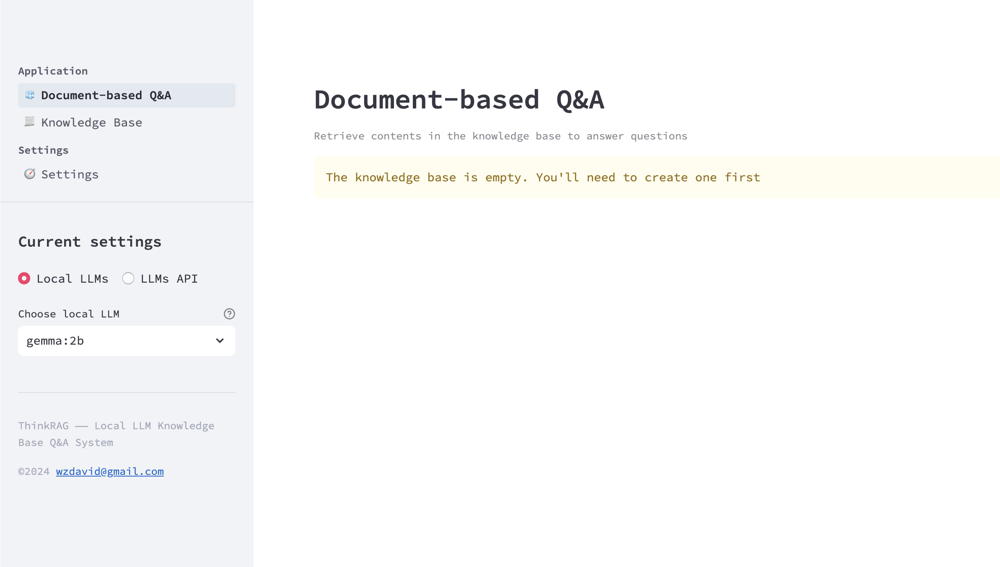

<p align="center">
  <a href="./README.md">English</a> |
  <a href="./README_zh.md">简体中文</a>
</p>

<div align="center">

[](./LICENSE) [](https://lancedb.com/) [](https://ollama.com/) [](https://www.llamaindex.ai/)


</div>

### Table of Contents

- 🤔 [What is ThinkRAG](#What-is-ThinkRAG)
- ✨ [Key Features](#Key-Features)
- 🛫 [Quick Start](#quick-start)
- 📖 [Usage](#engine-interface-instructions)
- 🔬 [Technology Stack](#Modes-Comparison)
- 🧸 [Support Models](#Support-Models)
- 📄 [License](#license)

<div id='What-is-ThinkRAG'></a>

# What is ThinkRAG 🤔

ThinkRAG is a well designed LLM RAG system, which can be easily deployed on your laptop. The system is built upon LlamaIndex and Streamlit, and optimized in many areas for Chinese users. The system support local LLM models from Ollama and BAAI embedding and reranker models from HuggingFace. It also supports using OpenAI API and compatible LLM APIs like Zhipu, DeepSeek, Moonshot, etc.


<div id='Key-Features'></a>

# Key Features ✨

ThinkRAG is production ready system for professionals to use local multi-modal knowledge base on their personal computers, where private data never leave from.

- Complete application of LlamaIndex
- Support local storage with no need to install database
- Run easily on laptops without GPU support
- Support local models and offline usage

The following are features for Chinese users:
- Use Spacy Text Splitter for better processing Chinese characters
- Adopt Chinese Title Enhancements
- Use prompt templates in Chinese for Q&A and refinement processes.
- Support LLM service providers like Zhipu, DeepSeek and Moonshot from local users in China
- Use bilingual embedding models like BAAI/bge-large-zh-v1.5

</br>


<div id='quick-start'></a>

# Quick Start 🛫

## Step 1
```zsh
pip3 install -r requirements.txt
```
## Step 2

You may download models (BAAI/bge-large-zh-v1.5, BAAI/bge-reranker-base) to your local machine, in case you need run the system without Internet connection. 

Please refer to this [instructions](Instructions.md) on how to download models from HuggingFace into your  "localmodels" directory.

## Step 3

For better performance, it is recommended to use LLM API. 

1. Get your API key from the LLM service provider and configure the environment variables as follows. You may choose to use one of them and remove others in the config.py file. Absolutely you may also add other compatible API in the file.

```zsh
ZHIPU_API_KEY = ""
MOONSHOT_API_KEY = ""
DEEPSEEK_API_KEY = ""
OPENAI_API_KEY = ""
```

2. If you prefer to use local LLM, you may do so via Ollama. Please download [Ollama](https://ollama.com/download) first. Then download [models](https://ollama.com/library) like Gemma and QWen using Ollama commands. 

You can find a complete list of LLMs provided by Ollama from its website.

## step 4

ThinkRAG runs in development mode by default which is the best choice for personal computers. 

If you have a server, please configure the environment variable THINKRAG_ENV as below to switch to production mode.

```zsh
THINKRAG_ENV = prod
```

Please refer to the [detailed comparison](#Modes-Comparison) to learn the details about the two modes.

## Step 5

Now you are ready to run ThinkRAG. Please run the following command in the directory where app.py exists.

```zsh
streamlit run app.py
```

<div align="center">

</a>
</div>

<div id='engine-interface-instructions'></a>

# Usage 📖

There are detailed instructions on how to use ThinkRAG and how to customize it for your purpose, please refer to this [document](Instructions.md).

<div id='Modes-Comparison'></a>

# Technology Stack 🔬

| |DEV_MODE|PROD_MODE|
|:----|:----|:----|
|Framework|LlamaIndex|LlamaIndex|
|Frontend|Streamlit|Streamlit|
|Embedding Models|BAAI/bge-large-zh-v1.5|BAAI/bge-large-zh-v1.5|
|Reranker|BAAI/bge-reranker-base|BAAI/bge-reranker-base|
|Text Splitter|SentenceSplitter|SpacyTextSplitter|
|Chat Store|SimpleChatStore|Redis|
|Doc Store|SimpleDocumentStore|Redis or MangoDB|
|Index Store|SimpleIndexStore|Redis or MangoDB|
|Vector Store|SimpleVectorStore|LanceDB as default, Chroma and ES supported|

<div id='Support-Models'></a>

# Support Models 🧸

All LLMs provided by Ollama, OpenAI, Zhipu, Moonshot, DeepSeek and all OpenAI compatible LLM API

<div id='license'></a>

# License 📄

ThinkRAG uses MIT License. See [here](LICENSE) for details.