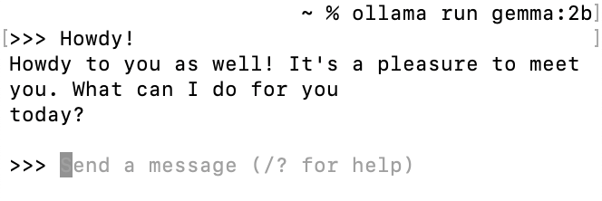

<p align="center">
  <a href="./README.md">English</a> |
  <a href="./README_zh.md">简体中文</a>
</p>

<div align="center">

[](./LICENSE) [](#LanceDB) [](#model-support)


</div>

### 目录

- 🤔 [ThinkRAG](#What-is-ThinkRAG)
- ✨ [主要功能](#Key-Features)
- 📝 [Demo](#Demo)
- 🛫 [快速开始](#quick-start)
- ⚙️ [设置API密钥](#set-api-key)
  - [MacOS & Linux](#MacOS-Linux)
  - [Windows](#Windows)
- 📖 [应用界面详解](#engine-interface-instructions)
- 🪀 [模型支持](#model-support)
- 📄 [授权条款](#license)
- 🔜 [项目计划](#Future-Plans)
- ❓ [常见问题](#FAQ)
- ☎️ [联系我们](#Contact-Us)


<div id='What-is-ThinkRAG'></a>

# 什么是ThinkRAG🤔

ThinkRAG是一款基于文档检索的开源RAG引擎。

<div id='Key-Features'></a>

# 主要功能：

<details open>
  <summary>
    <b>展开</b>
  </summary>


### 知识库管理：

&emsp;&emsp; ThinkRAG 允许用户从文件（如 PDF、DOCX 和 TXT 文件）和网页上传、管理和索引内容。这包括设置文本处理参数以确保数据的最佳组织和可检索性。

### API 配置：

&emsp;&emsp; ThinkRAG 提供了广泛的 API 配置设置，包括设置服务地址、选择模型以及启用诸如嵌入模型重排等特定功能。这有助于集成和管理各种语言和嵌入模型，以在知识库中用于增强数据处理和检索。

### 高级设置：

&emsp;&emsp; ThinkRAG 还包括允许用户进一步优化系统行为和交互模式的高级设置，如调整响应选择标准和自定义系统提示。

<div id='LanceDB'></a>

### 支持LanceDB：

&emsp;&emsp; LanceDB 作为开源多模态向量数据库，具备以下核心优势：
- 针对时间序列数据优化：专为时间序列数据设计，适合实时监控，物联网设备数据、金融交易数据等。
- 高性能处理：具有高数据吞吐率和快速查询性能，适用于实时分析。
- 可扩展性强：支持水平扩展，可以通过增加节点来处理更大的负载。
- 高效数据压缩：采用先进的数据压缩技术优化存储并提高 I/O 效率。
- 灵活的数据保留策略：支持自定义数据保留政策，自动降采样或删除旧数据。
- 强大的查询语言：提供强大而灵活的查询语言，支持数据库内复杂的数据分析和聚合。
- 内置可视化工具：可能包括集成的数据可视化和仪表盘工具，简化数据监控和分析。

浏览[LanceDB官网](https://lancedb.com/)以了解更多信息。

</br>

</details>

<div id='Demo'></a>

# Demo 📝

<details open>
  <summary>
    <b>展开</b>
  </summary>
  请于此处试用本项目demo!
</details>

<div id='quick-start'></a>

# Quick Start 🛫
<details open>
  <summary>
    <b>展开</b>
  </summary>

## Step 1
```bash
pip3 install -r requirements.txt
```
## Step 2

参考 [此处](/docs/HowToDownloadModels.md) 将嵌入模型和自然语言工具包下载进localmodels路径

## Step 3
若需使用LLMs API，请优先配置API Key，详见[设置API密钥](#set-api-key)

最后，使用以下命令来运行 ThinkRAG
```bash
streamlit run app.py
```

</details>


<div id='set-api-key'></a>


# 设置密钥 ⚙️

<div id='MacOS-Linux'></a>

## MacOS & Linux

<details open>
  <summary>
    <b>展开</b>
  </summary>


## 设置临时 API 密钥
### 1. 运行以下指令
```bash
export VARIABLE_NAME=value
```
例如，要设置OpenAI的API密钥, 则运行以下指令:
```bash
export OPENAI_API_KEY=your_OpenAI_API_key 
```
<br/>

## 设置永久 API 密钥
### 1. 创建或编辑 '.zshenv' 文件

```bash
nano ~/.zshenv
```
对于Linux, macOS Mojave (10.14) 或更早版本, 运行 
```bash
nano ~/.bashrc
```
### 2. 添加个人配置
```bash
export VARIABLE_NAME="value"
```
例如，要设置OpenAI的API密钥, 则运行以下指令:
```bash
export OPENAI_API_KEY=your_OpenAI_API_key 
```
### 3. 保存并退出
'Ctrl + O'用于保存更改, 按下'Enter'以确认并输入'Ctrl + X‘退出编辑。

### 4. 应用做出的更改
为确保更改生效，运行
```bash
source ~/.zshenv 
# source ~/.bashrc for Linux, macOS Mojave (10.14) or earlier
```

</details>

<div id='Windows'></a>

## Windows

<details open>
  <summary>
    <b>展开</b>
  </summary>

### 运行以下命令

```bash
set VARIABLE_NAME=value # Set Temporary API Key
```

```bash
setx VARIABLE_NAME "value" -m # Set Permanent API Key
```

</br>

</details>

<div id='engine-interface-instructions'></a>

# 应用界面详解 📖

<details open>
  <summary>
    <b>展开</b>
  </summary>

</br>

应用界面的详细功能及操作详解，见[此处](Instructions_zh.md)

</details>

<div id='model-support'></a>

# 模型支持 🪀

<details open>
  <summary>
    <b>展开</b>
  </summary>

</br>

ThinkRAG 支持 Ollama 并对以下[模型](#Tested-Models)进行了测试。要使用这些 Ollama 模型，请先在设备上[安装 Ollama](https://ollama.com/download)。

### 安装需要的模型
控制台中运行以下指令以安装需要的 Ollama 模型：
```zsh
ollama pull <model_name>
```
>_*我们建议您尽量指定具体的 model_name，否则将默认指向符合您所指示的名称的最新的、最小参数的模型，而非您想要的模型.*_

要确认下载是否成功，可以通过查看您下载的所有模型：
```zsh
ollama list
```
或直接运行指定模型：
```zsh
ollama run <model_name>
```

以 gemma:2b 为例：
<div align="center">

</a>
</div>

<div id='Tested-Models'></a>

### 支持的 Ollama 模型及其他 LLMs

<table>
<tr>
<th> Ollama 模型 </th>
<th> LLMs </th>
</tr>
<tr>
<td>

gemma:2b

llama2-chinese:13b

llama2:13b

mistral:latest

deepseek-coder:33b

deepseek-coder:latest

gemma:latest

</td>
<td>

glm-4

glm-4v

glm-3-turbo

moonshot-v1-8k

moonshot-v1-32k

moonshot-v1-128k

deepseek-chat

deepseek-coder

gpt-4

gpt-3.5

gpt-4o

</td>
</tr>
</table>

</br>

</details>

<div id='license'></a>

# 授权条款 📄

ThinkRAG 遵循 MIT 授权条款，详情请见[此处](LICENSE)

<div id='Future-Plans'></a>

# 项目计划 🔜

<div id='FAQ'></a>

# 常见问题❓

<div id='Contact-Us'></a>

# 联系我们 ☎️

##### 官方公众号